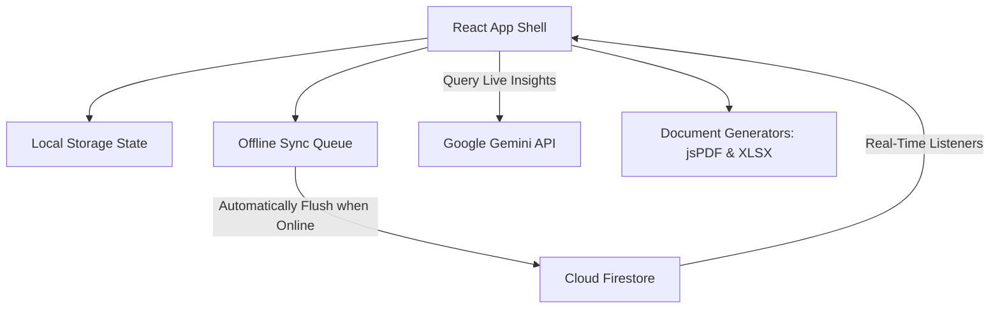
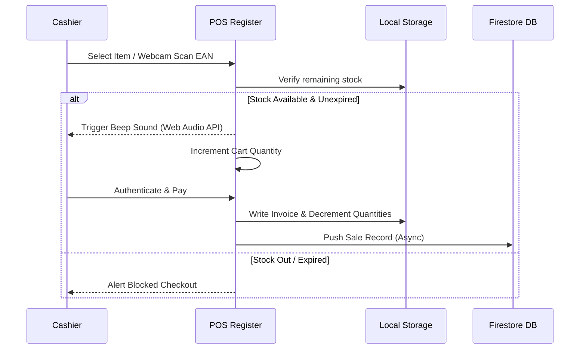
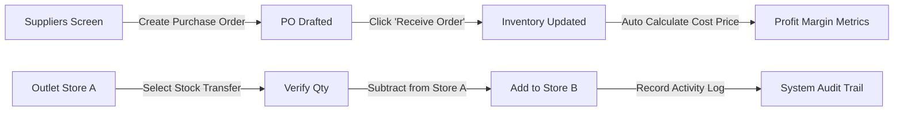

# 🛒 ApexCart 2.0 — Comprehensive Project Report & System Documentation

ApexCart is an enterprise-grade, offline-first Point of Sale (POS) and Real-Time Business Intelligence (BI) system optimized for supermarkets, retail malls, and multi-stall outlets. 

This document serves as the master technical report and system documentation, detailing the architecture, state synchronization, frontend design system, features, database configuration, security guidelines, and development operations of ApexCart 2.0.

---

## 🏗️ 1. System Architecture & Core Philosophy

ApexCart is designed as a high-fidelity local-first web application. Its primary operational requirement is continuous cashier checkout capability even during network dropouts or cloud failures.

### Architectural Patterns



1. **Single Source of Truth (SSOT)**: 
   The application state is managed at the root [App.jsx](file:///c:/Users/shubh/OneDrive/Desktop/sms/src/App.jsx) level. Crucial databases (products, sales, suppliers, expenses, logs) are synced down from Cloud Firestore. Child components consume these datasets and update them using callback methods, ensuring predictable, unidirectional data flow.
2. **Offline-First Synchronization**:
   - The application monitors network status via window connection events (`online` / `offline`).
   - If cashiers perform checkouts or modify configurations while offline, transactions are appended to the `offlineSyncQueue` and persisted to local storage.
   - When connection is re-established, the queue automatically syncs back to Firebase Cloud Firestore using batch-like sync tasks.
3. **Multi-Store Logical Segregation**:
   - The app isolates inventories and logs between distinct outlets (e.g. **Store A** and **Store B**).
   - Component workflows dynamically filter catalog products and sales reports based on the globally active `currentStore` key.
4. **Stall-Based Multi-Tenancy (Vendor Stalls)**:
   - Users are authenticated and checked against their roles. Staff accounts can be assigned to specific vendors (e.g., *Apex Grocery*, *Apex Fresh*).
   - The application filters visibility of products and sales data so staff members see only their assigned vendor's statistics.

---

## 🛠️ 2. Technology Stack

### Frontend Core
- **Framework**: **React 19** (Functional Components, Hooks, React Context placeholders, Memoization).
- **Bundler & Dev Server**: **Vite 8** (Utilizing fast hot module replacement and building optimized production bundles).
- **Styling Engine**: **Vanilla CSS 3** with custom properties (CSS variables) for high-performance dark/light theme shifts.
- **Motion Graphic Library**: **Framer Motion 12** (Powering panel animations, page transitions, and interactive button clicks).

### Cloud Infrastructure
- **Database**: **Firebase Cloud Firestore (v12)** (Using NoSQL document collections and real-time snapshots).
- **Authentication**: **Firebase Auth** (Validating cashier and admin credentials).
- **Artificial Intelligence**: **Google Gemini API (`gemini-3.5-flash`)** (Providing inventory predictions, procurement insights, and low-stock auditing).

### Special Libraries
- **Scanner Feed**: `html5-qrcode` (Enables webcam integration to capture physical barcode SKU tags in real-time).
- **Barcode Rendering**: `jsbarcode` (Generates SVG barcodes for printing and labeling new catalog items).
- **Document Exporting**:
  - `jspdf` & `jspdf-autotable` (Generates thermal receipt print files and physical BI report documents).
  - `xlsx` (Compiles active sales ledgers and inventory sheets into Excel format).
- **Icons**: `lucide-react` (Lightweight SVG vector library).

---

## 🎨 3. Redesign 2.0 Design System & Aesthetics

ApexCart 2.0 introduces a premium, modern design language centered on **Midnight & Indigo Glassmorphism**. This aesthetic emphasizes visual depth, harmony, micro-animations, and usability under low-light checkout environments.

### Core Token Rules ([index.css](file:///c:/Users/shubh/OneDrive/Desktop/sms/src/index.css))
- **Color Palette**: Curated slate whites, dark sapphire blues, vivid indigo accents, and semantic alerts (Rose for danger, Emerald for success, Amber for warning).
- **Glassmorphism**: Leverages `.glass-panel` utilities with `backdrop-filter: blur(24px)` and fine borders (`1px solid rgba(255, 255, 255, 0.08)`) to give widgets a premium layered feel.
- **Dynamic Shadows**: Employs glow states (`--shadow-glow`) utilizing soft primary gradients.
- **Aesthetic Variables**:
  ```css
  --color-bg-base: #020617; /* Very Dark Slate */
  --color-bg-surface-glass: rgba(15, 23, 42, 0.75);
  --color-primary: #60a5fa; /* Light Professional Blue */
  --glass-blur: 24px;
  ```

---

## 🔄 4. Workflows & Logistical Loops

### Cashier POS Checkout Loop


### Stock Transfer & Supplier Logistics Loop


---

## 🗂️ 5. Directory & File Structure

The workspace files are grouped logically by functionality:

- **Root Configurations**:
  - [package.json](file:///c:/Users/shubh/OneDrive/Desktop/sms/package.json): Lists build scripts and project dependencies.
  - [vite.config.js](file:///c:/Users/shubh/OneDrive/Desktop/sms/vite.config.js): Custom bundler configurations.
  - [firestore.rules](file:///c:/Users/shubh/OneDrive/Desktop/sms/firestore.rules): Security constraints for database reads/writes.
  - [index.html](file:///c:/Users/shubh/OneDrive/Desktop/sms/index.html): HTML5 index template containing Google Fonts linking.

- **Source Entry Points**:
  - [src/main.jsx](file:///c:/Users/shubh/OneDrive/Desktop/sms/src/main.jsx): React application bootstrapping.
  - [src/App.jsx](file:///c:/Users/shubh/OneDrive/Desktop/sms/src/App.jsx): Command center managing global database sync, user role hooks, and active tab transitions.
  - [src/index.css](file:///c:/Users/shubh/OneDrive/Desktop/sms/src/index.css): Central stylesheet declaring theme tokens, glassmorphism modifiers, and layout overrides.
  - [src/firebase.js](file:///c:/Users/shubh/OneDrive/Desktop/sms/src/firebase.js): Initializes Firebase App, Firestore database references, and Auth services.

- **Component Modules ([src/components/](file:///c:/Users/shubh/OneDrive/Desktop/sms/src/components/))**:
  - [Login.jsx](file:///c:/Users/shubh/OneDrive/Desktop/sms/src/components/Login.jsx): Floating glass-panel card displaying secure credentials for testing (Admin and Staff roles).
  - [Sidebar.jsx](file:///c:/Users/shubh/OneDrive/Desktop/sms/src/components/Sidebar.jsx): Fluid navigation bar with scroll overrides, user status meters, and dark mode toggles.
  - [Dashboard.jsx](file:///c:/Users/shubh/OneDrive/Desktop/sms/src/components/Dashboard.jsx): Displays core KPI widgets side-by-side (Sales Velocity Area charts and Inventory Category proportions). It separates expired products and soon-to-expire items into distinct lists.
  - [POS.jsx](file:///c:/Users/shubh/OneDrive/Desktop/sms/src/components/POS.jsx): POS register supporting search filtering, webcam barcode scanning, discount rules, tax estimations, and invoice printing.
  - [Inventory.jsx](file:///c:/Users/shubh/OneDrive/Desktop/sms/src/components/Inventory.jsx): Catalog manager containing SKU search, expiry dates, supplier associations, Stock Transfer modals, and SVG barcode printing.
  - [Suppliers.jsx](file:///c:/Users/shubh/OneDrive/Desktop/sms/src/components/Suppliers.jsx): Vendor tracking and Purchase Order logs to manage inventory refills.
  - [Expenses.jsx](file:///c:/Users/shubh/OneDrive/Desktop/sms/src/components/Expenses.jsx): Overhead tracker that computes operational expenses, feeding into net profit equations.
  - [History.jsx](file:///c:/Users/shubh/OneDrive/Desktop/sms/src/components/History.jsx): Invoices register allowing managers to audit sales details and process item refunds.
  - [Reports.jsx](file:///c:/Users/shubh/OneDrive/Desktop/sms/src/components/Reports.jsx): Generates date-filtered BI reports, custom charts, tax estimates, and handles xlsx/pdf exporting.
  - [Settings.jsx](file:///c:/Users/shubh/OneDrive/Desktop/sms/src/components/Settings.jsx): Configuration utility to set Low Stock levels, Expiry alerts, customize store info, and update Gemini API keys.
  - [Invoice.jsx](file:///c:/Users/shubh/OneDrive/Desktop/sms/src/components/Invoice.jsx): specialized receipt layout optimized for 80mm thermal receipt roll printers.
  - [Chatbot.jsx](file:///c:/Users/shubh/OneDrive/Desktop/sms/src/components/Chatbot.jsx): Built-in smart chatbot. Connects to the Gemini API (`gemini-3.5-flash`), with a robust local fallback engine that performs local algorithms when offline.

---

## 🔒 6. Security & Data Integrity

ApexCart 2.0 maintains high database security and audit logs:

1. **Role-Based Access Control (RBAC)**:
   Sensitive admin tasks (such as restocks, configuration modifications, expense management, and supplier profiles) require the user to have an `admin` role. The app checks roles in `App.jsx` and restricts views.
2. **Append-Only Auditing**:
   The `activityLogs` collection is designated as **write-once**. The system registers checkouts, stock transfers, and price changes here. Updates or deletes to this collection are disabled via database security rules.
3. **Firestore Database Protection ([firestore.rules](file:///c:/Users/shubh/OneDrive/Desktop/sms/firestore.rules))**:
   Database configurations prevent unauthorized modifications by testing user authorization tokens before executing writes.
4. **Credential & Secret Protection**:
   The Gemini API key is managed dynamically: it is saved in settings (persisted in Firestore) and retrieved dynamically at runtime instead of hardcoding API keys in static Javascript bundles.

---

## 🚀 7. Installation & Operational Guides

### Local Setup
1. **Clone the repository** and open the folder in your terminal:
   ```bash
   cd sms
   ```
2. **Install dependencies**:
   ```bash
   npm install
   ```
3. **Configure the Environment**:
   Create a `.env` file in the root folder with the following variables:
   ```env
   VITE_FIREBASE_API_KEY=your_api_key
   VITE_FIREBASE_AUTH_DOMAIN=your_auth_domain
   VITE_FIREBASE_PROJECT_ID=your_project_id
   VITE_FIREBASE_STORAGE_BUCKET=your_storage_bucket
   VITE_FIREBASE_MESSAGING_SENDER_ID=your_messaging_sender_id
   VITE_FIREBASE_APP_ID=your_app_id
   ```
4. **Run in Development**:
   ```bash
   npm run dev
   ```
   Open `http://localhost:5173/` in your browser.

### Publishing & Deployment
ApexCart is compiled into static HTML/JS/CSS assets and hosted via GitHub Pages:
- **Build & Publish Command**:
  ```bash
  npm run deploy
  ```
  This script executes `predeploy` (`npm run build`) to generate the optimized output in the `dist` directory, then deploys the contents directly to the `gh-pages` branch.
