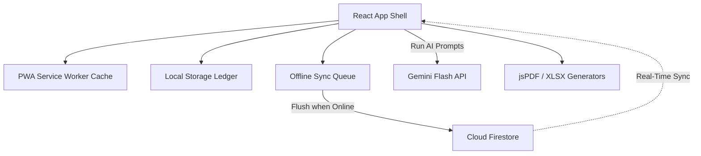
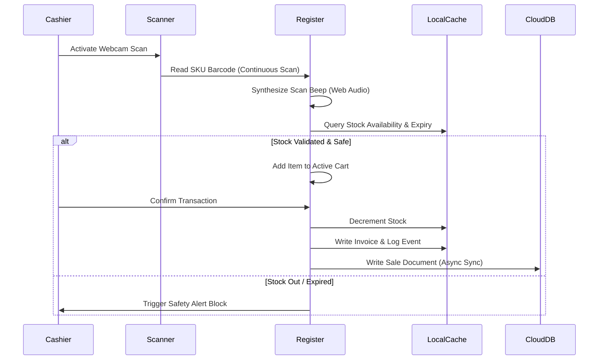
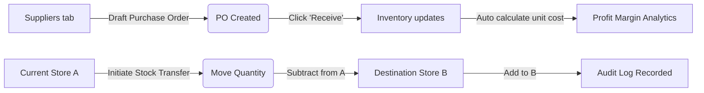

# ApexCart: Next-Generation Retail POS & BI Suite
*Hackathon Pitch Deck & Technical Specification*

---

## 🛝 Slide 1: Pitch Abstract

### **ApexCart**
> *Transforming standard retail checkouts into robust business intelligence platforms with smart AI procurement, offline resilience, and multi-store logistics.*

- **Problem**: Main street retail outlets suffer from unstable internet connection dropouts, high licensing costs for separate POS/BI packages, complex stock transfer logistics, and insecure deployment keys.
- **Solution**: A unified, responsive app shell featuring local-first POS registers, webcam scanner integrations, auto-calculating moving averages forecasting, write-once security logs, and a dynamic settings-based key manager.

---

## 🛝 Slide 2: Technical Architecture

This system maintains an **Offline-First Synchronization Architecture**:

### Key Engineering Features
1. **Dynamic Key Resolution**: Gemini API tokens are fetched from a Firestore general config settings document at runtime rather than static environment variables.
2. **Synthetic Scan Audits**: Web Audio API generates browser-native scanner validation soundscapes offline without network requests.
3. **Optimized SVG Engine**: High-fidelity line/bar charts are rendered dynamically using inline SVGs to maintain a zero-library dashboard dependency.

---

## 🛝 Slide 3: Transaction Flowcharts

### Cashier Checkout Workflow (POS Terminal)

### Stock Transfer & Supplier PO Logistical Loop

---

## 🛝 Slide 4: Retail Screen Mockups

### **1. Executive Business Intelligence Dashboard**
Displays Revenue metrics, Gross Profit margin indexes, and the hourly peak sales trendline.

---

## 🛝 Slide 5: Checkout Interface

### **2. POS Checkout Register & Barcode Scan Terminal**
Features product list, active shopping cart, scanner viewport, and payment options.

