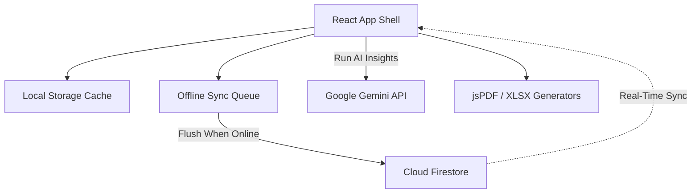

# 📊 ApexCart 2.0 Project Report & Developer Documentation

Welcome to the comprehensive system documentation for **ApexCart 2.0**. This report outlines the system architecture, core workflows, technology stack, design system changes, database schemas, security configurations, and installation/deployment procedures.

---

## 🏗️ 1. System Architecture & Core Philosophy

ApexCart 2.0 is built as a highly resilient, offline-first Progressive Web App (PWA) tailored for enterprise checkout environments. The primary operational objective is allowing retail registers to run without interruptions during local network outages.

### Architectural Blueprint



### Design Principles
1. **Single Source of Truth (SSOT)**: The top-level [App.jsx](file:///c:/Users/shubh/OneDrive/Desktop/sms/src/App.jsx) holds the core databases (`products`, `sales`, `suppliers`, `expenses`, `activityLogs`). Any changes propagate downward, keeping rendering consistent.
2. **Offline-First Synchronization**: Checkouts and settings modifications executed offline are queued in `offlineSyncQueue`, persisted to local storage, and synced to Cloud Firestore when internet connection is restored.
3. **Store Segregation**: Multi-outlet support dynamically isolates catalog records and inventory volumes between separate stores (e.g. **Store A** and **Store B**).
4. **Role & Vendor Multi-Tenancy**: Custom user profiles dictate role rights (e.g. Admin vs Employee) and vendor scope (e.g. Grocery vs Fresh).

---

## 🛠️ 2. Detailed Technology Stack

The project utilizes modern, lightweight modules to build a zero-bloat standalone app shell:

| Layer | Component/Library | Purpose |
| :--- | :--- | :--- |
| **Frontend Core** | React 19, Vite 8 | Lightning-fast HMR, component isolation, optimized Rolldown production builds. |
| **Styling** | CSS Custom Properties | Custom Midnight & Indigo Glassmorphism theme with instant Dark/Light mode shifting. |
| **Database** | Firebase Cloud Firestore (v12) | Real-time NoSQL cloud collections for products, sales, and settings. |
| **Authentication** | Firebase Authentication | Secure cashier logins and access roles verification. |
| **AI Integration** | Google Gemini API (`gemini-3.5-flash`) | Stock level auditing, automated PO recommendations, and BI chat assistance. |
| **Hardware / Barcode** | `html5-qrcode` & `jsbarcode` | Webcam EAN scan feed and on-demand SVG barcode generator. |
| **Document Compilation** | `jspdf`, `jspdf-autotable` & `xlsx` | Offline compilation of cash invoices, BI reports, and Excel sheets. |
| **Icons & Motion** | `lucide-react` & `framer-motion` | Lightweight SVG icons and spring-based UI transitions. |

---

## 🎨 3. Redesign 2.0 Aesthetics & Design System

The redesign establishes a sleek, executive aesthetic utilizing modern design tokens:

- **Theme Tokens ([index.css](file:///c:/Users/shubh/OneDrive/Desktop/sms/src/index.css))**: CSS variables declare colors, borders, shadows, and radii for easy modifications.
- **Glassmorphism**: `.glass-panel` utilities with `backdrop-filter: blur(24px)` and semi-transparent backgrounds create a floating, high-end feel.
- **Animations**: Subtle hover glows (`.glow-hover`) and fade animations (`.animate-slide`) indicate user interactivity.
- **Refined Layouts**: 
  - The side-by-side Sales Velocity graph and Inventory Categories row provide clear visual hierarchies.
  - A scroll-aware sidebar holds navigation items while keeping "Sign Out" and "Dark Mode" locked to the bottom.

---

## 🗂️ 4. Workspace Components & File Map

Here is the directory file structure detailing the core files:

### Application Engine
- [App.jsx](file:///c:/Users/shubh/OneDrive/Desktop/sms/src/App.jsx): Main shell executing authentication validation, Firestore snapshots, local storage syncer, and active views.
- [index.css](file:///c:/Users/shubh/OneDrive/Desktop/sms/src/index.css): Theme rules defining responsive layouts, colors, shapes, buttons, and animations.
- [firebase.js](file:///c:/Users/shubh/OneDrive/Desktop/sms/src/firebase.js): Initializes Cloud references for Firestore and Authentication.

### UI Views ([src/components/](file:///c:/Users/shubh/OneDrive/Desktop/sms/src/components/))
- [Login.jsx](file:///c:/Users/shubh/OneDrive/Desktop/sms/src/components/Login.jsx): centeral login panel displaying test credentials for easy cashier and manager access.
- [Sidebar.jsx](file:///c:/Users/shubh/OneDrive/Desktop/sms/src/components/Sidebar.jsx): Collapsible glassmorphic sidebar featuring status indicators and theme controls.
- [Dashboard.jsx](file:///c:/Users/shubh/OneDrive/Desktop/sms/src/components/Dashboard.jsx): Displays core business KPIs, charts, and separates expired and expiring products into distinct warning groups.
- [POS.jsx](file:///c:/Users/shubh/OneDrive/Desktop/sms/src/components/POS.jsx): Registers sales with barcode webcam inputs and prints 80mm thermal cashier slips.
- [Inventory.jsx](file:///c:/Users/shubh/OneDrive/Desktop/sms/src/components/Inventory.jsx): Manages inventory items, stock levels, vendor lists, and stock transfer operations.
- [Suppliers.jsx](file:///c:/Users/shubh/OneDrive/Desktop/sms/src/components/Suppliers.jsx): Coordinates vendor purchase orders (PO) and handles catalog adjustments.
- [Expenses.jsx](file:///c:/Users/shubh/OneDrive/Desktop/sms/src/components/Expenses.jsx): Logs administrative overhead costs to output net profit reports.
- [History.jsx](file:///c:/Users/shubh/OneDrive/Desktop/sms/src/components/History.jsx): Registers transaction histories and handles refunds.
- [Reports.jsx](file:///c:/Users/shubh/OneDrive/Desktop/sms/src/components/Reports.jsx): Aggregates sales statistics and exports accounts to Excel/PDF.
- [Settings.jsx](file:///c:/Users/shubh/OneDrive/Desktop/sms/src/components/Settings.jsx): Configures low-stock indicators, expiry limits, and custom Gemini API keys.
- [Chatbot.jsx](file:///c:/Users/shubh/OneDrive/Desktop/sms/src/components/Chatbot.jsx): Multi-model AI assistant with an offline fallback engine analyzing catalog thresholds when disconnected.

---

## 🔒 5. Database Schema & Security Controls

### Firestore Structure
- `/products/{sku}`: Logs `name`, `price`, `costPrice`, `quantity`, `store`, `expiryDate`, `gst`, `vendor`.
- `/sales/{txId}`: Registers `items[]`, `subtotal`, `tax`, `totalPrice`, `store`, `timestamp`, `cashier`.
- `/suppliers/{id}`: Profiles vendor details.
- `/purchaseOrders/{poId}`: Logs purchase orders.
- `/activityLogs/{logId}`: Systems actions logs.

### Security Configurations ([firestore.rules](file:///c:/Users/shubh/OneDrive/Desktop/sms/firestore.rules))
- **Role Validation**: Enforces admin checks on Firestore modifications.
- **Immutable Log Audits**: Configures `activityLogs` as append-only, preventing updates or deletions.
- **Key Security**: Dynamically loads Gemini API keys from database documents at runtime to protect Vite build files.

---

## 🚀 6. Developer Operational Guide

### Installation
1. Navigate to directory:
   ```bash
   cd sms
   ```
2. Run installation:
   ```bash
   npm install
   ```
3. Set up environment: Create a `.env` in the root workspace folder specifying the Firestore variables:
   ```env
   VITE_FIREBASE_API_KEY=your_api_key
   VITE_FIREBASE_AUTH_DOMAIN=your_auth_domain
   VITE_FIREBASE_PROJECT_ID=your_project_id
   VITE_FIREBASE_STORAGE_BUCKET=your_storage_bucket
   VITE_FIREBASE_MESSAGING_SENDER_ID=your_messaging_sender_id
   VITE_FIREBASE_APP_ID=your_app_id
   ```
4. Run locally:
   ```bash
   npm run dev
   ```

### Deploying Changes
ApexCart 2.0 runs continuous deployment onto GitHub Pages:
- **Build and Publish command**:
  ```bash
  npm run deploy
  ```
  This automates Vite building (`dist/` directory output) and triggers `gh-pages` to publish the new changes onto the live branch.
